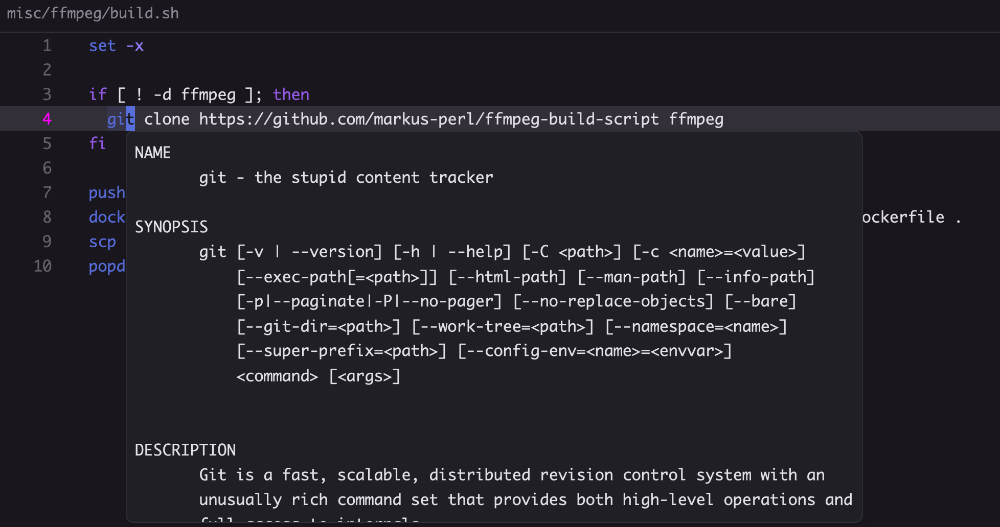

# Bash suppport for Zed

Tree-sitter: https://github.com/tree-sitter/tree-sitter-bash

Language Server: https://github.com/bash-lsp/bash-language-server



# shellcheck

The [bash-language-server](https://github.com/bash-lsp/bash-language-server) supports shellcheck.
However, you need to [install shellcheclk manually](https://github.com/koalaman/shellcheck#installing)

```bash
brew install shellcheck         # MacOS
sudo apt-get install shellcheck # Ubuntu / Debian
sudo pacman -S shellcheck       # Arch Linux
choco install shellcheck        # Windows (chocolatey)
```

## Shellcheck ignores

If you wish to ignore certain ShellCheck warnings in your files, you can add an inline comment `# shellcheck disable=SC0000` specifying the warning/error.

Alternatively, if you'd like to ignore something for an entire file, put the comment at the top of the file.

For example, to ignore [SC2034](https://www.shellcheck.net/wiki/SC2034) `foo appears unused. Verify it or export it.` in an `.env` file, it would look like so:

```sh
# shellcheck disable=SC2034
FOO=123
BAR="something"
DATABASE_URL="postgres://something"
```

# shfmt

bash-language-server can support formatting using `shfmt` if it is available in your path. Install with:

```sh
brew install shfmt         # MacOS
sudo apt-get install shfmt # Ubuntu / Debian
sudo pacman -S shfmt       # Arch Linux
choco install shfmt        # Windows (chocolatey)
```

To control automatic formatting you can use [`format_on_save`](https://zed.dev/docs/configuring-zed#format-on-save) in your Zed settingts or manually invoke `editor: format document` from the command palette.
